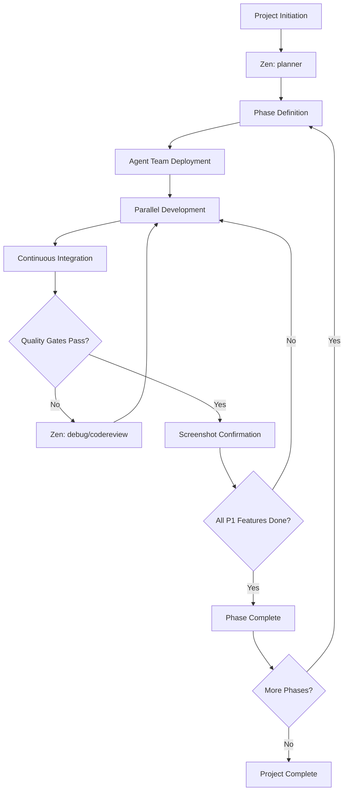

# AI Agent Development Workflow - Master Index

**Version**: 3.0
**Last Updated**: 2025-01-30  
**Workflow Type**: Phase-Based Collaborative Development

---

## ⚠️ MANDATORY REQUIREMENTS (READ FIRST!)

**Before starting ANY work, you MUST comply with these requirements. These are not optional.**

### 1. Agent Team Deployment - REQUIRED

**DECISION TREE - When to Deploy Multi-Agent Teams:**

❓ **Is this an iOS/Android/Web project with 3+ features?**
- **YES** → ✅ **YOU MUST DEPLOY MULTI-AGENT TEAM** (proceed below)
- **NO** → Single agent may be acceptable for prototypes only

❓ **Is this a complex bug fix affecting multiple files/systems?**
- **YES** → ✅ **YOU MUST DEPLOY MULTI-AGENT TEAM**
- **NO** → Single agent may be acceptable

❓ **Is this a major refactoring or architectural change?**
- **YES** → ✅ **YOU MUST DEPLOY MULTI-AGENT TEAM**
- **NO** → Single agent may be acceptable

**DEFAULT RULE**: **If uncertain, deploy the team.** Multi-agent coordination is better than missed requirements.

**IMMEDIATE ACTION REQUIRED:**
1. See team structures in [Agent Deployment Guide](./docs/agent-deployment.md)
2. **iOS Projects**: Deploy 5-agent team (Coordinator + Architecture + UI + Feature + Testing)
3. **Web Projects**: Deploy 6-agent team (Coordinator + Backend + Frontend + UI + Database + Testing)
4. **Coordinator Agent MUST be deployed first** and spawn other agents

❌ **VIOLATION**: Working solo on multi-feature/multi-file projects
✅ **COMPLIANCE**: Deploying coordinator + specialist agents for complex work

---

### 2. iOS Development Standards - REQUIRED

**WHEN**: Any iOS development task
**COMPLIANCE**: These rules are NON-NEGOTIABLE project requirements

✅ **MANDATORY - You MUST Use:**
- **SwiftUI** (exclusively for UI) - target iOS 17.0+
- **SwiftData** (for data persistence)
- **@Observable** (for state management)
- **async/await** (for asynchronous operations)
- **NavigationStack** (for navigation)

❌ **FORBIDDEN - You MUST NOT Use:**
- **UIKit** (except when SwiftUI genuinely lacks required APIs)
- **Core Data** (SwiftData only)
- **Combine** / `@Published` / `@ObservableObject` / `@StateObject` (use @Observable)
- **Completion handlers/closures** for async operations (use async/await)
- **NavigationView** (deprecated, use NavigationStack)

**📖 BEFORE WRITING ANY iOS CODE**: Read [iOS Development Guidelines](./docs/ios-development.md) in full

❌ **VIOLATION**: Using UIKit, Core Data, or Combine in new code
✅ **COMPLIANCE**: Following the mandatory tech stack above

---

### 3. Quality Gates - REQUIRED

**WHEN**: Before marking ANY task/feature/phase as complete
**COMPLIANCE**: ALL gates must pass, no exceptions

**MANDATORY Pre-Completion Checklist:**
- ✅ Run `zen precommit` tool (**NO EXCEPTIONS** - required before every commit)
- ✅ Provide screenshot evidence (saved in `tracking/screenshots/`)
- ✅ All tests passing (minimum 70% coverage)
- ✅ Builds successfully with no errors
- ✅ Code reviewed (`zen codereview` passed)
- ✅ Feature works end-to-end as specified

**📖 Complete checklist**: [Quality Gates](./docs/quality-gates.md)

❌ **VIOLATION**: Committing without precommit check, missing screenshots, failing tests
✅ **COMPLIANCE**: All quality gates pass before marking complete

---

### 4. Phase Gates - REQUIRED (Proactive Quality)

**WHEN**: At the END of EVERY phase
**COMPLIANCE**: Run all three analyses, document findings

**MANDATORY Phase Completion Sequence:**
1. ✅ Run `zen analyze` (quality focus) → Document baseline in `tracking/knowledge-base/`
2. ✅ Run `zen refactor` (codesmells) → Update `tracking/technical-debt-log.md`
3. ✅ Run `zen analyze` (performance focus) → Update `tracking/performance-baseline.md`
4. ✅ Address ALL critical/high severity issues before phase closure
5. ✅ Create phase summary with all continuation IDs

**Time Investment**: 15-20 minutes per phase
**Value**: Prevents 50-70% of bugs from reaching later phases

❌ **VIOLATION**: Completing a phase without running phase gates
✅ **COMPLIANCE**: All three analyses run and documented

---

## 🎯 Overview

This documentation provides a complete, phase-based development workflow for AI agent teams building production-quality applications. The system emphasizes:

- **Parallel execution** with coordinated oversight
- **Incremental delivery** of working features
- **Quality gates** ensuring completion criteria
- **Session continuity** across handoffs
- **Zen MCP tool integration** for enhanced collaboration

---

## 📚 Documentation Structure

### Core Workflow Documents

| Document | Purpose | When to Use |
|----------|---------|-------------|
| **[Workflow Improvements Summary](./WORKFLOW-IMPROVEMENTS-SUMMARY.md)** | **Complete guide to Tier 1-3 improvements** | **Start here for overview of new features** |
| [PRD Template](./docs/PRD.md) | Product Requirements Document template | Phase 0 planning, before using planner |
| [Agent Deployment](./docs/agent-deployment.md) | Multi-agent team structures and coordination | Project setup, team coordination |
| [Project Management](./docs/project-management.md) | Phase-based planning and execution | Planning, tracking, delivery |
| [Session Management](./docs/session-management.md) | Context preservation and handoffs | Every session, agent transitions |
| [iOS Development](./docs/ios-development.md) | iOS technical standards (Swift/SwiftUI) | All iOS development tasks |
| [Testing Guidelines](./docs/testing-guidelines.md) | Testing requirements and quality gates | Feature completion, QA |
| [Zen Tools Guide](./docs/zen-tools-guide.md) | Leveraging Zen MCP tools effectively | Throughout all phases |
| **[Tool Chaining Patterns](./docs/tool-chaining-patterns.md)** | **Effective tool sequences for common scenarios** | **Complex tasks, decisions, debugging** |
| **[ADR Guide](./docs/adr/README.md)** | **Architecture Decision Records** | **Major architectural/design decisions** |
| [Mock Data Strategy](./docs/mock-data-strategy.md) | Mock-to-real data transition planning | Data modeling, API integration |
| [Quality Gates](./docs/quality-gates.md) | Completion criteria for tasks/phases **(includes Phase Gates)** | Before marking anything complete |

### Tracking & Knowledge Base

| Document | Purpose | When to Update |
|----------|---------|----------------|
| [Technical Debt Log](./tracking/technical-debt-log.md) | Track debt trends across phases | End of every phase (mandatory) |
| [Performance Baseline](./tracking/performance-baseline.md) | Performance metrics and regression detection | End of every phase (mandatory) |
| Knowledge Base (`tracking/knowledge-base/`) | Preserve tool outputs and continuation IDs | Ongoing (ADRs, analyses, retros) |

---

## 🚀 Quick Start by Project Type

### iOS Application Development

**Phase 0: Setup**
1. Review [Agent Deployment](./docs/agent-deployment.md) → Select **iOS Development Team**
2. Create or review [PRD](./docs/PRD.md) → Define product requirements and features
3. Review [Project Management](./docs/project-management.md) → Understand phase structure
4. Review [iOS Development](./docs/ios-development.md) → Understand technical standards
5. Use **Zen `planner`** tool with PRD to create detailed project plan 

**Phase 1: Core Infrastructure (P1)**
1. Coordinator assigns tasks to parallel agents
2. Each agent uses [Session Management](./docs/session-management.md) for continuity
3. Implement with [Mock Data Strategy](./docs/mock-data-strategy.md)
4. Verify against [Quality Gates](./docs/quality-gates.md) before completion
5. Use **Zen `codereview`**, **`debug`**, **`precommit`** as needed

**Phase 2+: Feature Development**
1. Repeat phase-based approach
2. Transition mock data to real APIs early
3. Continuous integration and testing
4. Screenshot confirmation for each feature

**Tools to Use**: `planner`, `analyze`, `codereview`, `debug`, `precommit`, `apilookup`

---

### Web Application Development

**Phase 0: Setup**
1. Review [Agent Deployment](./docs/agent-deployment.md) → Select **Web Development Team**
2. Create or review [PRD](./docs/PRD.md) → Define product requirements and features
3. Review [Project Management](./docs/project-management.md) → Understand phase structure
4. Use **Zen `planner`** tool with PRD for architecture planning

**Phase 1-N: Iterative Development**
1. Coordinator orchestrates parallel frontend/backend work
2. Mock data tracked via [Mock Data Strategy](./docs/mock-data-strategy.md)
3. Quality gates ensure completeness
4. Cross-browser testing required

**Tools to Use**: `planner`, `consensus`, `thinkdeep`, `refactor`, `challenge`

---

## ⚡ Proactive Quality Workflows (NEW)

### Overview: Reactive → Proactive Shift

**Before**: Tools used reactively (when problems occur)
- `debug` when bugs happen
- `codereview` before completion
- `refactor` when code smells obvious

**Now**: Tools used proactively (prevent problems before they occur)
- **Phase Gates**: Mandatory `analyze` + `refactor` + `analyze` (perf) at every phase end
- **ADRs**: Formal decision documentation with `challenge` + `consensus`
- **Continuous Monitoring**: Track quality/debt/performance trends

### 🎯 Tier 1: Mandatory (Start Immediately)

#### 1. Phase Gate Validations ⚠️ REQUIRED

**At END of EVERY Phase**:
```yaml
Phase Completion Checklist (MANDATORY):
1. Run `analyze` (general/quality focus)
   → Establish quality baseline
   → Save continuation_id
   → Document in tracking/knowledge-base/phase-X-quality-report.md

2. Run `refactor` (codesmells)
   → Identify technical debt
   → Save continuation_id
   → Update tracking/technical-debt-log.md
   → Track trend: ⬆️ Increasing / ➡️ Stable / ⬇️ Decreasing

3. Run `analyze` (performance focus)
   → Measure build time, app launch, memory, size
   → Save continuation_id
   → Update tracking/performance-baseline.md
   → Flag regressions >10%

4. Address CRITICAL/HIGH issues before phase closure

5. Create phase-X-summary.md with all continuation IDs
```

**Time**: 15-20 minutes per phase
**Value**: Catch 50-70% of issues before they become problems

**See**: [Quality Gates](./docs/quality-gates.md) Section 7 for complete checklist

#### 2. Architecture Decision Records (ADRs)

**For Major Decisions**:
```yaml
Decision Workflow (Recommended):
1. `challenge` → Question assumptions
2. `consensus` → Multi-model analysis (for/against/neutral)
   → 2-3 models with different stances
   → Save continuation_id
3. (Optional) `thinkdeep` → Deep investigation if complex
   → Reuse continuation_id for context
4. Create ADR → docs/adr/ADR-NNN-title.md
   → Include all continuation IDs
   → Document alternatives, rationale, trade-offs
```

**Examples of ADR-worthy decisions**:
- State management approach (SwiftUI @Observable vs TCA)
- Data persistence (SwiftData vs Core Data vs Realm)
- API architecture (REST vs GraphQL)
- Navigation patterns
- Major framework/library choices

**Time**: 20-30 minutes per decision
**Value**: Better decisions, preserved knowledge, context for future

**See**: [ADR Guide](./docs/adr/README.md) for templates and examples

#### 3. Technical Debt Monitoring

**Every Phase End**:
```yaml
Debt Tracking:
1. Run `refactor` (part of phase gates above)
2. Log debt count by severity in tracking/technical-debt-log.md
3. Compare to previous phase
4. If debt increasing ⬆️:
   → Budget 10-20% of next phase for debt reduction
   → Address CRITICAL immediately
```

**Time**: 10-15 minutes per phase (included in phase gates)
**Value**: Prevents debt snowball, makes debt visible

**See**: [Technical Debt Log](./tracking/technical-debt-log.md) for tracking template

### 🔥 Tier 2: High Value (Start Next Phase)

#### 4. Performance Baseline & Regression Detection

**Phase 1**: Establish baseline
**Phase 2+**: Compare and detect regressions

**Platform-Specific Metrics**:
- **iOS**: Build time, cold start, memory, binary size
- **Web**: Bundle size, TTI, FCP, LCP
- **Backend**: API response times (p50/p95/p99), throughput

**See**: [Performance Baseline](./tracking/performance-baseline.md) for platform-specific templates

#### 5. Tool Chaining Patterns

**Use proven sequences for**:
- Major architectural decisions
- Complex bug investigations
- Phase completions
- Major feature additions
- Code review + improvement cycles
- Performance optimizations
- Pre-release validations

**Example Pattern - Major Decision**:
```
challenge → consensus (save ID) → thinkdeep (reuse ID) → ADR
```

**See**: [Tool Chaining Patterns](./docs/tool-chaining-patterns.md) for complete pattern library

#### 6. Knowledge Base System

**Structure**:
```
tracking/knowledge-base/
├── architecture-decisions/  # ADR tool outputs
├── performance-analysis/     # analyze (perf) outputs
├── technical-debt/           # refactor outputs
└── retrospectives/           # Phase retrospectives
```

**Purpose**: Preserve continuation IDs and full tool outputs for:
- Context reuse in future sessions
- Agent handoffs
- Institutional knowledge
- Tool chain reference

### 📊 Tier 3: Advanced (Future)

#### 7. Dependency Monitoring
- Monthly `apilookup` for all major dependencies
- Check deprecations, security advisories
- Plan migrations proactively

#### 8. Cross-Phase Retrospectives
- Every 2-3 phases
- Comprehensive `analyze` of entire codebase
- Use `consensus` for improvement priorities
- Track long-term quality trends

**See**: [Retrospective Template](./tracking/knowledge-base/retrospectives/template.md)

---

### Quick Reference: Proactive Workflow

```
EVERY PHASE END (Mandatory):
├─ analyze (quality) → quality-report.md → Save ID
├─ refactor (debt) → technical-debt-log.md → Save ID
├─ analyze (performance) → performance-baseline.md → Save ID
├─ Address CRITICAL/HIGH issues
└─ Create phase-X-summary.md with all IDs

MAJOR DECISIONS (Recommended):
├─ challenge → Question assumptions
├─ consensus → Multi-model validation → Save ID
├─ (Optional) thinkdeep → Deep dive → Reuse ID
└─ Create ADR-NNN.md → Document with IDs

CONTINUOUS:
├─ Use tool chaining patterns for complex work
├─ Save continuation IDs in knowledge base
└─ Track trends: Quality ↗️, Debt ↘️, Performance →
```

**Full Details**: See [Workflow Improvements Summary](./WORKFLOW-IMPROVEMENTS-SUMMARY.md)

---

## 🔄 Complete Development Workflow



---

## 🤖 Agent Team Structures

### iOS Development Team (5 agents)

```yaml
Team: ios-development
Size: 5 agents
Mode: Parallel with coordination

Roles:
  - Coordinator Agent (1)
    - Manages workflow
    - Ensures quality gates
    - Maintains session continuity
    - Uses: planner, consensus, challenge
    
  - Architecture Agent (1)
    - SwiftUI architecture
    - SwiftData models
    - Uses: analyze, thinkdeep, apilookup
    
  - Feature Development Agents (2)
    - Parallel feature implementation
    - UI and logic
    - Uses: codereview, debug, refactor
    
  - Testing Agent (1)
    - Unit/UI tests
    - Quality verification
    - Uses: precommit, debug
```

**See**: [Agent Deployment Guide](./docs/agent-deployment.md) for full details

---

## 📋 Phase-Based Development Process

### Phase Structure

Every project follows this pattern:

```
Phase 0: Foundation
├── Product Requirements Document (PRD)
├── Project setup
├── Architecture planning (Zen: planner with PRD)
├── Mock data strategy
└── Quality gate definition

Phase 1: Core P1 Features
├── Minimal viable functionality
├── Essential user flows
├── Basic UI (fully functional)
└── ✅ Quality gates: Build + Run + Screenshot

Phase 2: Enhanced Features
├── P2 priority features
├── Improved UX
├── Real API integration
└── ✅ Quality gates: Tests + Build + Screenshot

Phase N: Polish & Launch
├── Performance optimization (Zen: refactor)
├── Comprehensive testing
├── Production readiness
└── ✅ Quality gates: All tests + Production build
```

**See**: [Project Management Guide](./docs/project-management.md) for detailed methodology

---

## ✅ Quality Gate Requirements

### Before Marking ANY Task Complete:

**Code Quality**
- ✅ Follows relevant guidelines ([iOS](./docs/ios-development.md), Web, etc.)
- ✅ Code review passed (Zen `codereview`)
- ✅ Pre-commit checks passed (Zen `precommit`)
- ✅ No linting errors or warnings

**Functionality**
- ✅ Feature works as specified
- ✅ **Screenshot evidence** provided
- ✅ No crashes or critical bugs
- ✅ Navigation/user flow verified

**Testing** (see [Testing Guidelines](./docs/testing-guidelines.md))
- ✅ Unit tests written and passing
- ✅ Integration tests (where applicable)
- ✅ Manual testing completed

**Build Verification**
- ✅ iOS: `.xcodeproj` builds successfully
- ✅ iOS: Runs on simulator without crash
- ✅ iOS: Feature accessible and functional
- ✅ Web: Development server runs
- ✅ Web: Production build succeeds

**Documentation**
- ✅ Code comments for complex logic
- ✅ README updated (if needed)
- ✅ Mock data tracking updated

**Pre-Commit Verification** (MANDATORY)
- ✅ Zen `precommit` tool executed successfully
- ✅ All precommit findings addressed
- ✅ No critical or high severity issues
- ✅ Build passes after all changes

**See**: [Quality Gates Guide](./docs/quality-gates.md) for complete checklist

---

## 🔧 Zen MCP Tools Integration

### Throughout Development Lifecycle

| Phase | Primary Zen Tools | Purpose |
|-------|------------------|---------|
| **Planning** | `planner`, `thinkdeep` | Break down project, identify dependencies |
| **Architecture** | `analyze`, `thinkdeep`, `consensus` | Design decisions, pattern selection |
| **Development** | `chat`, `clink`, `apilookup` | Implementation support, API docs |
| **Code Review** | `codereview`, `challenge` | Quality assurance, critical review |
| **Debugging** | `debug`, `analyze` | Issue resolution, root cause analysis |
| **Pre-Commit** | `precommit`, `codereview` | Final verification before commit |
| **Refactoring** | `refactor`, `consensus` | Code improvement, team alignment |

**See**: [Zen Tools Guide](./docs/zen-tools-guide.md) for detailed usage patterns

---

## 🎭 Session Management

### Critical Practices

**Every Session Start**
1. Load previous context (Zen `chat` with continuation_id)
2. Review [Session Management](./docs/session-management.md)
3. Check current phase/task status
4. Verify mock data tracking

**During Work**
1. Update session state regularly
2. Document decisions and changes
3. Track blockers and dependencies
4. Use Zen tools for collaboration

**Session Handoff**
1. Comprehensive state documentation
2. Clear next steps
3. Blocker identification
4. Context preservation for next agent

**Before ANY Commit**
1. ✅ **MANDATORY**: Run Zen `precommit` tool
2. ✅ All findings addressed or documented
3. ✅ Quality gates passed
4. ✅ No critical issues remaining

**See**: [Session Management Guide](./docs/session-management.md)

---

## 📊 Mock Data Strategy

### Principles

**Track Everything**
- ✅ Which components use mock data
- ✅ Mock data structure and location
- ✅ Target real API endpoint
- ✅ Migration priority and timeline

**Transition Early**
- Phase 1: Mock data acceptable for P1 features
- Phase 2: Begin real API integration
- Phase 3: All mock data replaced (except tests)

**See**: [Mock Data Strategy Guide](./docs/mock-data-strategy.md)

---

## 📁 Project Structure

### Standard Layout

```
project-root/
├── claude.md                          # This file
├── docs/
│   ├── PRD.md                         # Product Requirements Document
│   ├── agent-deployment.md            # Team structures
│   ├── project-management.md          # Phase planning
│   ├── session-management.md          # Continuity
│   ├── ios-development.md             # iOS standards
│   ├── testing-guidelines.md          # Testing requirements
│   ├── zen-tools-guide.md             # Zen MCP usage
│   ├── mock-data-strategy.md          # Data strategy
│   └── quality-gates.md               # Completion criteria
├── project/
│   ├── [iOS App].xcodeproj
│   └── [iOS App]/
│       ├── App/
│       ├── Models/
│       ├── Views/
│       ├── Stores/
│       └── Tests/
├── tracking/
│   ├── mock-data-registry.md          # Track mock data usage
│   ├── phase-status.md                # Current phase progress
│   └── screenshots/                   # Feature confirmations
└── README.md
```

---

## 🎯 Success Criteria

### Project Considered Complete When:

**All Phases Delivered**
- ✅ P1 features fully functional
- ✅ P2+ features implemented
- ✅ All quality gates passed

**Quality Standards Met**
- ✅ All tests passing
- ✅ Code reviews completed
- ✅ Pre-commit checks green
- ✅ No critical bugs

**Documentation Complete**
- ✅ User-facing documentation
- ✅ Technical documentation
- ✅ API documentation (if applicable)

**Production Ready**
- ✅ Performance acceptable
- ✅ Accessibility standards met
- ✅ Security reviewed
- ✅ Ready for deployment

---

## 🚦 Getting Started Checklist

### For New Projects:

- [ ] Read this complete document
- [ ] Create [PRD](./docs/PRD.md) defining product requirements and features
- [ ] Review [Agent Deployment](./docs/agent-deployment.md) and select team
- [ ] Review [Project Management](./docs/project-management.md) to understand phase structure
- [ ] Use Zen `planner` with PRD to create initial project plan
- [ ] Identify P1 features (minimum viable functionality)
- [ ] Set up [Session Management](./docs/session-management.md) tracking
- [ ] Create mock data registry using [Mock Data Strategy](./docs/mock-data-strategy.md)
- [ ] Review [Quality Gates](./docs/quality-gates.md) for completion criteria
- [ ] Review technical guidelines (e.g., [iOS Development](./docs/ios-development.md))
- [ ] Initialize project structure
- [ ] Deploy agent team
- [ ] Begin Phase 0: Foundation

---

## 🔒 Git Commit Protocol

### MANDATORY Pre-Commit Workflow

**⚠️ CRITICAL**: NO commits are allowed without successfully running zen precommit first.

### Pre-Commit Checklist

**1. Stage Changes**
```bash
git add [files]
git status  # Verify staged changes
```

**2. Run Zen Precommit (MANDATORY)**
```yaml
Tool: zen:precommit
Parameters:
  model: "gemini-2.5-pro"  # or preferred model
  step: "Verify changes ready for commit: [brief description]"
  findings: "All features implemented, tests passing"
  path: "/absolute/path/to/repo"
  include_staged: true
  include_unstaged: false  # Only check what will be committed
  relevant_files:
    - [list all modified files]
  step_number: 1
  total_steps: 3
  next_step_required: true
```

**3. Address ALL Findings**
- ✅ Fix critical issues immediately
- ✅ Fix high priority issues
- ✅ Document or fix medium/low issues
- ✅ Re-run precommit if changes made
- ❌ Do NOT commit with unresolved critical/high issues

**4. Commit ONLY After Precommit Passes**
```bash
git commit -m "feat: descriptive message

- Detail 1
- Detail 2

Zen precommit: PASSED ✅"
```

**5. Verification**
- ✅ Build still passes after commit
- ✅ Tests still pass after commit
- ✅ No new issues introduced

### Enforcement

**Who Enforces**:
- **ALL Agents**: Must run precommit before committing
- **Coordinator Agent**: Verifies precommit was run
- **Testing Agent**: Confirms precommit results

**Consequences of Skipping Precommit**:
1. Commit will be flagged for review
2. May need to be reverted
3. Re-work required
4. **Quality gates fail**

### When to Run Precommit

**Required**:
- ✅ Before EVERY git commit
- ✅ Before marking any task complete
- ✅ Before marking any phase complete
- ✅ Before any handoff to another agent
- ✅ After fixing any bugs/issues

**Optional** (but recommended):
- Before major refactoring
- After merging branches
- Before starting new work (verify clean state)

---

## 🔄 Continuous Improvement

### Feedback Loop

**After Each Phase**
1. Retrospective (Zen `consensus`)
2. Update processes if needed
3. Refine quality gates
4. Improve agent coordination

**Documentation Updates**
- Version all changes
- Track what works/doesn't work
- Evolve best practices

---

## 📞 Support & Resources

### When Things Go Wrong

**Build Failures**
1. Use Zen `debug` for root cause analysis
2. Review [Testing Guidelines](./docs/testing-guidelines.md)
3. Check [Quality Gates](./docs/quality-gates.md)
4. Consult technical guidelines

**Agent Coordination Issues**
1. Review [Agent Deployment](./docs/agent-deployment.md)
2. Use Zen `consensus` for alignment
3. Coordinator agent intervention

**Lost Context**
1. Check [Session Management](./docs/session-management.md)
2. Review session state files
3. Reconstruct from git history

**Mock Data Confusion**
1. Consult [Mock Data Strategy](./docs/mock-data-strategy.md)
2. Review mock-data-registry.md
3. Prioritize real API migration

---

## 📖 Document Version History

| Version | Date | Changes |
|---------|------|---------|
| 2.0 | 2025-01-20 | Complete modular workflow with Zen tools integration |
| 1.0 | 2025-01-20 | Initial iOS development guidelines |

---

## ⚡ Quick Reference

**Most Common Workflow**:
1. Review PRD → Understand requirements
2. `planner` (with PRD) → Create plan
3. Deploy agents → Parallel work
4. `codereview` → Verify quality
5. `debug` → Fix issues
6. **`precommit` → MANDATORY before ANY commit** ⚠️
7. Build + Screenshot → Verify
8. Commit ONLY after precommit passes ✅
9. Mark complete ✅

**Remember**:
- ⚠️ **NEVER commit without running zen precommit first!**
- Nothing is complete until it builds, runs, and has screenshot proof! 📸

---

**Related Documentation**:
- 📄 [PRD Template](./docs/PRD.md)
- 🤖 [Agent Deployment](./docs/agent-deployment.md)
- 📋 [Project Management](./docs/project-management.md)
- 🔄 [Session Management](./docs/session-management.md)
- 📱 [iOS Development](./docs/ios-development.md)
- ✅ [Testing Guidelines](./docs/testing-guidelines.md)
- 🔧 [Zen Tools Guide](./docs/zen-tools-guide.md)
- 📊 [Mock Data Strategy](./docs/mock-data-strategy.md)
- 🚦 [Quality Gates](./docs/quality-gates.md)
