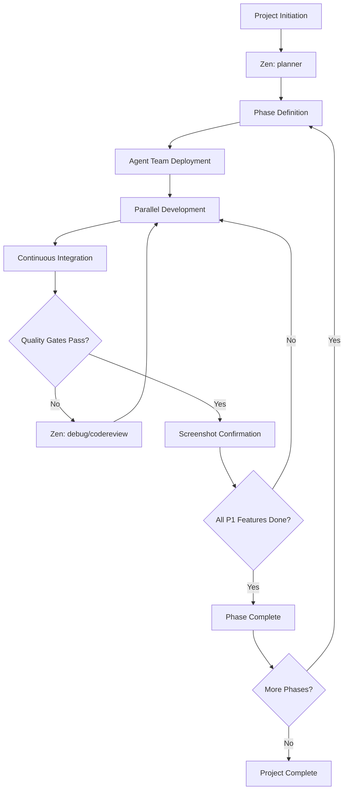

# AI Agent Development Workflow - Master Index

**Version**: 2.0  
**Last Updated**: 2025-01-20  
**Workflow Type**: Phase-Based Collaborative Development

---

## 🎯 Overview

This documentation provides a complete, phase-based development workflow for AI agent teams building production-quality applications. The system emphasizes:

- **Parallel execution** with coordinated oversight
- **Incremental delivery** of working features
- **Quality gates** ensuring completion criteria
- **Session continuity** across handoffs
- **Zen MCP tool integration** for enhanced collaboration

---

## 📚 Documentation Structure

### Core Workflow Documents

| Document | Purpose | When to Use |
|----------|---------|-------------|
| [PRD Template](./docs/PRD.md) | Product Requirements Document template | Phase 0 planning, before using planner |
| [Agent Deployment](./docs/agent-deployment.md) | Multi-agent team structures and coordination | Project setup, team coordination |
| [Project Management](./docs/project-management.md) | Phase-based planning and execution | Planning, tracking, delivery |
| [Session Management](./docs/session-management.md) | Context preservation and handoffs | Every session, agent transitions |
| [iOS Development](./docs/ios-development.md) | iOS technical standards (Swift/SwiftUI) | All iOS development tasks |
| [Testing Guidelines](./docs/testing-guidelines.md) | Testing requirements and quality gates | Feature completion, QA |
| [Zen Tools Guide](./docs/zen-tools-guide.md) | Leveraging Zen MCP tools effectively | Throughout all phases |
| [Mock Data Strategy](./docs/mock-data-strategy.md) | Mock-to-real data transition planning | Data modeling, API integration |
| [Quality Gates](./docs/quality-gates.md) | Completion criteria for tasks/phases | Before marking anything complete |

---

## 🚀 Quick Start by Project Type

### iOS Application Development

**Phase 0: Setup**
1. Review [Agent Deployment](./docs/agent-deployment.md) → Select **iOS Development Team**
2. Create or review [PRD](./docs/PRD.md) → Define product requirements and features
3. Review [Project Management](./docs/project-management.md) → Understand phase structure
4. Review [iOS Development](./docs/ios-development.md) → Understand technical standards
5. Use **Zen `planner`** tool with PRD to create detailed project plan 

**Phase 1: Core Infrastructure (P1)**
1. Coordinator assigns tasks to parallel agents
2. Each agent uses [Session Management](./docs/session-management.md) for continuity
3. Implement with [Mock Data Strategy](./docs/mock-data-strategy.md)
4. Verify against [Quality Gates](./docs/quality-gates.md) before completion
5. Use **Zen `codereview`**, **`debug`**, **`precommit`** as needed

**Phase 2+: Feature Development**
1. Repeat phase-based approach
2. Transition mock data to real APIs early
3. Continuous integration and testing
4. Screenshot confirmation for each feature

**Tools to Use**: `planner`, `analyze`, `codereview`, `debug`, `precommit`, `apilookup`

---

### Web Application Development

**Phase 0: Setup**
1. Review [Agent Deployment](./docs/agent-deployment.md) → Select **Web Development Team**
2. Create or review [PRD](./docs/PRD.md) → Define product requirements and features
3. Review [Project Management](./docs/project-management.md) → Understand phase structure
4. Use **Zen `planner`** tool with PRD for architecture planning

**Phase 1-N: Iterative Development**
1. Coordinator orchestrates parallel frontend/backend work
2. Mock data tracked via [Mock Data Strategy](./docs/mock-data-strategy.md)
3. Quality gates ensure completeness
4. Cross-browser testing required

**Tools to Use**: `planner`, `consensus`, `thinkdeep`, `refactor`, `challenge`

---

## 🔄 Complete Development Workflow



---

## 🤖 Agent Team Structures

### iOS Development Team (5 agents)

```yaml
Team: ios-development
Size: 5 agents
Mode: Parallel with coordination

Roles:
  - Coordinator Agent (1)
    - Manages workflow
    - Ensures quality gates
    - Maintains session continuity
    - Uses: planner, consensus, challenge
    
  - Architecture Agent (1)
    - SwiftUI architecture
    - SwiftData models
    - Uses: analyze, thinkdeep, apilookup
    
  - Feature Development Agents (2)
    - Parallel feature implementation
    - UI and logic
    - Uses: codereview, debug, refactor
    
  - Testing Agent (1)
    - Unit/UI tests
    - Quality verification
    - Uses: precommit, debug
```

**See**: [Agent Deployment Guide](./docs/agent-deployment.md) for full details

---

## 📋 Phase-Based Development Process

### Phase Structure

Every project follows this pattern:

```
Phase 0: Foundation
├── Product Requirements Document (PRD)
├── Project setup
├── Architecture planning (Zen: planner with PRD)
├── Mock data strategy
└── Quality gate definition

Phase 1: Core P1 Features
├── Minimal viable functionality
├── Essential user flows
├── Basic UI (fully functional)
└── ✅ Quality gates: Build + Run + Screenshot

Phase 2: Enhanced Features
├── P2 priority features
├── Improved UX
├── Real API integration
└── ✅ Quality gates: Tests + Build + Screenshot

Phase N: Polish & Launch
├── Performance optimization (Zen: refactor)
├── Comprehensive testing
├── Production readiness
└── ✅ Quality gates: All tests + Production build
```

**See**: [Project Management Guide](./docs/project-management.md) for detailed methodology

---

## ✅ Quality Gate Requirements

### Before Marking ANY Task Complete:

**Code Quality**
- ✅ Follows relevant guidelines ([iOS](./docs/ios-development.md), Web, etc.)
- ✅ Code review passed (Zen `codereview`)
- ✅ Pre-commit checks passed (Zen `precommit`)
- ✅ No linting errors or warnings

**Functionality**
- ✅ Feature works as specified
- ✅ **Screenshot evidence** provided
- ✅ No crashes or critical bugs
- ✅ Navigation/user flow verified

**Testing** (see [Testing Guidelines](./docs/testing-guidelines.md))
- ✅ Unit tests written and passing
- ✅ Integration tests (where applicable)
- ✅ Manual testing completed

**Build Verification**
- ✅ iOS: `.xcodeproj` builds successfully
- ✅ iOS: Runs on simulator without crash
- ✅ iOS: Feature accessible and functional
- ✅ Web: Development server runs
- ✅ Web: Production build succeeds

**Documentation**
- ✅ Code comments for complex logic
- ✅ README updated (if needed)
- ✅ Mock data tracking updated

**See**: [Quality Gates Guide](./docs/quality-gates.md) for complete checklist

---

## 🔧 Zen MCP Tools Integration

### Throughout Development Lifecycle

| Phase | Primary Zen Tools | Purpose |
|-------|------------------|---------|
| **Planning** | `planner`, `thinkdeep` | Break down project, identify dependencies |
| **Architecture** | `analyze`, `thinkdeep`, `consensus` | Design decisions, pattern selection |
| **Development** | `chat`, `clink`, `apilookup` | Implementation support, API docs |
| **Code Review** | `codereview`, `challenge` | Quality assurance, critical review |
| **Debugging** | `debug`, `analyze` | Issue resolution, root cause analysis |
| **Pre-Commit** | `precommit`, `codereview` | Final verification before commit |
| **Refactoring** | `refactor`, `consensus` | Code improvement, team alignment |

**See**: [Zen Tools Guide](./docs/zen-tools-guide.md) for detailed usage patterns

---

## 🎭 Session Management

### Critical Practices

**Every Session Start**
1. Load previous context (Zen `chat` with continuation_id)
2. Review [Session Management](./docs/session-management.md)
3. Check current phase/task status
4. Verify mock data tracking

**During Work**
1. Update session state regularly
2. Document decisions and changes
3. Track blockers and dependencies
4. Use Zen tools for collaboration

**Session Handoff**
1. Comprehensive state documentation
2. Clear next steps
3. Blocker identification
4. Context preservation for next agent

**See**: [Session Management Guide](./docs/session-management.md)

---

## 📊 Mock Data Strategy

### Principles

**Track Everything**
- ✅ Which components use mock data
- ✅ Mock data structure and location
- ✅ Target real API endpoint
- ✅ Migration priority and timeline

**Transition Early**
- Phase 1: Mock data acceptable for P1 features
- Phase 2: Begin real API integration
- Phase 3: All mock data replaced (except tests)

**See**: [Mock Data Strategy Guide](./docs/mock-data-strategy.md)

---

## 📁 Project Structure

### Standard Layout

```
project-root/
├── claude.md                          # This file
├── docs/
│   ├── PRD.md                         # Product Requirements Document
│   ├── agent-deployment.md            # Team structures
│   ├── project-management.md          # Phase planning
│   ├── session-management.md          # Continuity
│   ├── ios-development.md             # iOS standards
│   ├── testing-guidelines.md          # Testing requirements
│   ├── zen-tools-guide.md             # Zen MCP usage
│   ├── mock-data-strategy.md          # Data strategy
│   └── quality-gates.md               # Completion criteria
├── project/
│   ├── [iOS App].xcodeproj
│   └── [iOS App]/
│       ├── App/
│       ├── Models/
│       ├── Views/
│       ├── Stores/
│       └── Tests/
├── tracking/
│   ├── mock-data-registry.md          # Track mock data usage
│   ├── phase-status.md                # Current phase progress
│   └── screenshots/                   # Feature confirmations
└── README.md
```

---

## 🎯 Success Criteria

### Project Considered Complete When:

**All Phases Delivered**
- ✅ P1 features fully functional
- ✅ P2+ features implemented
- ✅ All quality gates passed

**Quality Standards Met**
- ✅ All tests passing
- ✅ Code reviews completed
- ✅ Pre-commit checks green
- ✅ No critical bugs

**Documentation Complete**
- ✅ User-facing documentation
- ✅ Technical documentation
- ✅ API documentation (if applicable)

**Production Ready**
- ✅ Performance acceptable
- ✅ Accessibility standards met
- ✅ Security reviewed
- ✅ Ready for deployment

---

## 🚦 Getting Started Checklist

### For New Projects:

- [ ] Read this complete document
- [ ] Create [PRD](./docs/PRD.md) defining product requirements and features
- [ ] Review [Agent Deployment](./docs/agent-deployment.md) and select team
- [ ] Review [Project Management](./docs/project-management.md) to understand phase structure
- [ ] Use Zen `planner` with PRD to create initial project plan
- [ ] Identify P1 features (minimum viable functionality)
- [ ] Set up [Session Management](./docs/session-management.md) tracking
- [ ] Create mock data registry using [Mock Data Strategy](./docs/mock-data-strategy.md)
- [ ] Review [Quality Gates](./docs/quality-gates.md) for completion criteria
- [ ] Review technical guidelines (e.g., [iOS Development](./docs/ios-development.md))
- [ ] Initialize project structure
- [ ] Deploy agent team
- [ ] Begin Phase 0: Foundation

---

## 🔄 Continuous Improvement

### Feedback Loop

**After Each Phase**
1. Retrospective (Zen `consensus`)
2. Update processes if needed
3. Refine quality gates
4. Improve agent coordination

**Documentation Updates**
- Version all changes
- Track what works/doesn't work
- Evolve best practices

---

## 📞 Support & Resources

### When Things Go Wrong

**Build Failures**
1. Use Zen `debug` for root cause analysis
2. Review [Testing Guidelines](./docs/testing-guidelines.md)
3. Check [Quality Gates](./docs/quality-gates.md)
4. Consult technical guidelines

**Agent Coordination Issues**
1. Review [Agent Deployment](./docs/agent-deployment.md)
2. Use Zen `consensus` for alignment
3. Coordinator agent intervention

**Lost Context**
1. Check [Session Management](./docs/session-management.md)
2. Review session state files
3. Reconstruct from git history

**Mock Data Confusion**
1. Consult [Mock Data Strategy](./docs/mock-data-strategy.md)
2. Review mock-data-registry.md
3. Prioritize real API migration

---

## 📖 Document Version History

| Version | Date | Changes |
|---------|------|---------|
| 2.0 | 2025-01-20 | Complete modular workflow with Zen tools integration |
| 1.0 | 2025-01-20 | Initial iOS development guidelines |

---

## ⚡ Quick Reference

**Most Common Workflow**:
1. Review PRD → Understand requirements
2. `planner` (with PRD) → Create plan
3. Deploy agents → Parallel work
4. `codereview` → Verify quality
5. `debug` → Fix issues
6. `precommit` → Final check
7. Build + Screenshot → Verify
8. Mark complete ✅

**Remember**: Nothing is complete until it builds, runs, and has screenshot proof! 📸

---

**Related Documentation**:
- 📄 [PRD Template](./docs/PRD.md)
- 🤖 [Agent Deployment](./docs/agent-deployment.md)
- 📋 [Project Management](./docs/project-management.md)
- 🔄 [Session Management](./docs/session-management.md)
- 📱 [iOS Development](./docs/ios-development.md)
- ✅ [Testing Guidelines](./docs/testing-guidelines.md)
- 🔧 [Zen Tools Guide](./docs/zen-tools-guide.md)
- 📊 [Mock Data Strategy](./docs/mock-data-strategy.md)
- 🚦 [Quality Gates](./docs/quality-gates.md)
